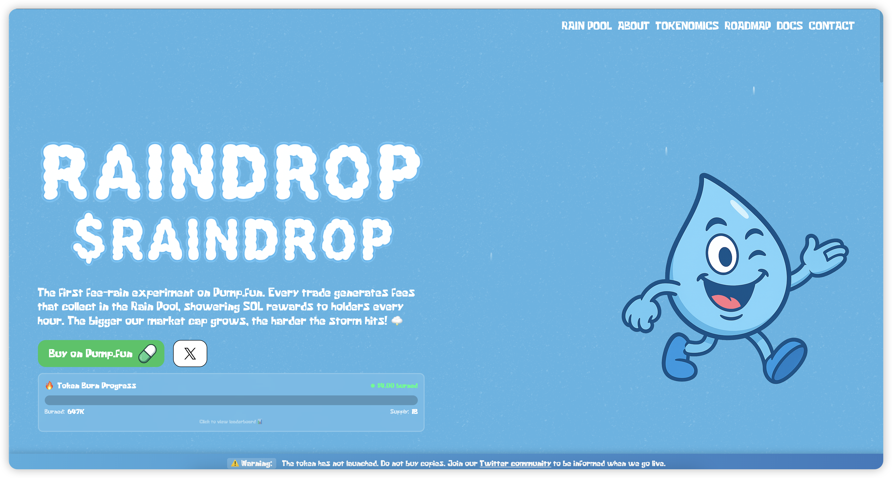
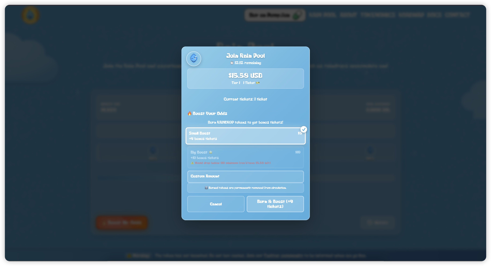
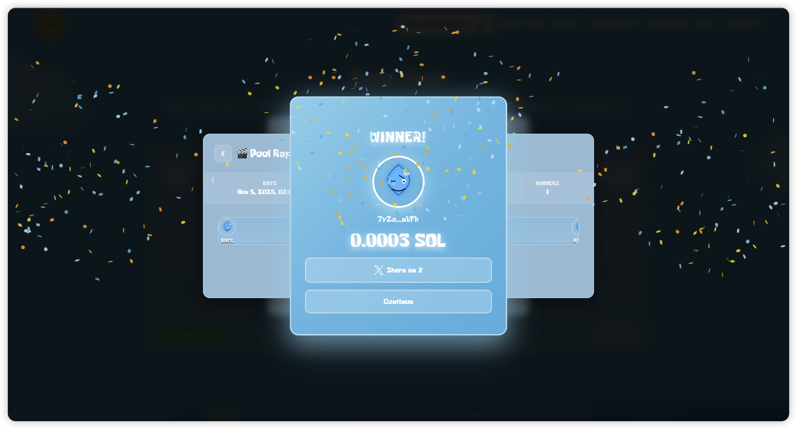
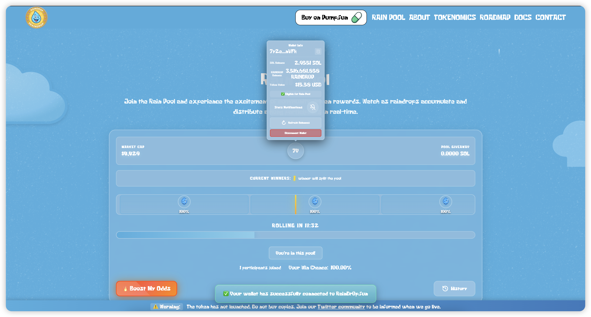
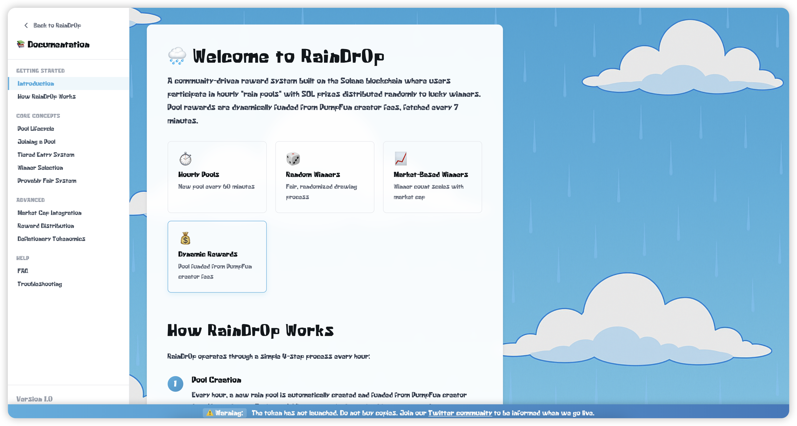
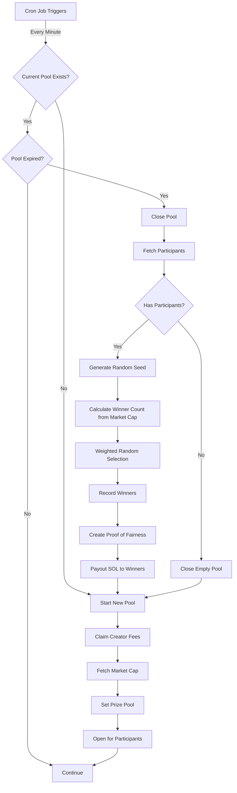

# 🌧️ RainDr0p - Solana Token Raffle Platform

<div align="center">

[](https://raindr0p.fun)
[](https://x.com/raindr0p_fun)
[](https://pump.fun/coin/4RB9s6anCqR9bwA5NBYPZdsY3pdkS43r9bGLJjBYpump)

**A gamified raffle platform built on Solana that distributes SOL rewards to token holders every 30 minutes**

*The first fee-rain experiment on Pump.Fun - Every trade generates fees that shower rewards to holders*

**🎉 Now Open Source!** Fork this repo and launch your own token raffle platform.

[Features](#-features) • [How It Works](#-how-it-works) • [Setup Guide](SETUP.md) • [Screenshots](#-screenshots) • [Tech Stack](#%EF%B8%8F-tech-stack) • [Architecture](#-architecture) • [Getting Started](#-getting-started)

</div>

---

## 🎯 What is RainDr0p?

RainDr0p is a revolutionary community-driven reward system on Solana where token holders participate in recurring 30-minute "rain pools" with real SOL prizes. Pool rewards are dynamically funded from PumpFun creator fees - the more the token trades, the bigger the prize pool grows!

### Key Highlights
- ⏰ **30-Minute Cycles** - New pools every 30 minutes with automatic winner selection
- 💰 **Dynamic Rewards** - Prizes funded from real trading fees, not inflation
- 🎟️ **Tiered Ticket System** - More holdings = more tickets = better odds
- 🔥 **Burn-to-Boost** - Optional token burning for bonus tickets
- 📈 **Market Cap Scaling** - Winner count grows with market cap (1-30+ winners)
- 🔐 **Provably Fair** - Cryptographically secure randomness with full transparency
- 📱 **Mobile Optimized** - Seamless experience across all devices

---

## 📸 Screenshots

### 🏠 Landing Page

*Hero section featuring the RainDr0p mascot, token burn progress tracker, and social links*

<br/>

### 🎰 RainPool - Live Raffle Interface

#### Desktop View - Active Pool

*Real-time pool interface showing market cap, prize pool, participant visualization, countdown timer, and win probability*

#### Desktop View - Empty Pool

*Clean interface when pool is waiting for participants - shows all information at a glance*

#### Mobile Responsive

*Fully responsive design optimized for mobile devices with touch-friendly controls*

<br/>

### 💎 Joining the Pool

#### Initial Join Modal

*User sees their holdings value, free ticket allocation, and burn boost options*

#### Burn Boost Options

*Players can burn tokens for bonus tickets - Small Boost ($5), Big Boost ($10), or custom amount*

<br/>

### 🎉 Winner Experience

#### Winner Celebration Modal

*Confetti celebration with winner's avatar, SOL prize amount, and Twitter share button*

<br/>

### 👤 User Stats & Wallet Integration


*Popover showing user's wallet info, token holdings, eligibility status, and participation stats*

<br/>

### 📚 Comprehensive Documentation


*In-depth docs covering pool lifecycle, ticket tiers, winner selection, and reward distribution*

---

## ✨ Features

### 🎯 Core Mechanics

#### Automatic Pool Lifecycle
- New pool created every 30 minutes automatically
- Claims PumpFun creator fees to fund prize pool
- Fetches live market cap and token price
- Closes expired pools and selects winners
- Instant payout to winners' wallets

#### Ticket-Based Entry System

**Free Tickets** (based on holdings):

| Tier | Holdings | Tickets | Badge |
|------|----------|---------|-------|
| 💧 Raindrop | $10 - $24 | 1 ticket | Bronze |
| 🌊 Puddle | $25 - $99 | 2 tickets | Silver |
| 🚿 Shower | $100 - $499 | 5 tickets | Gold |
| ⛈️ Storm | $500 - $999 | 10 tickets | Diamond |
| 🌀 Monsoon | $1,000+ | 20 tickets | Platinum |

**Burn Boost** (optional):
- 🔥 **Small Boost**: $5 = +0.5 bonus tickets
- 🔥 **Big Boost**: $10 = +1 bonus ticket
- 🔥 **Custom Amount**: Any amount = +1 ticket per $10

#### Multi-Winner Scaling

Winner count scales dynamically with market cap:

```
$5k - $100k    →  1 winner
$100k - $500k  →  2 winners
$500k - $1M    →  5 winners
$1M - $2M      →  10 winners
$2M - $3M      →  20 winners
$3M+           →  10 winners per $1M
```

Prize pool is split evenly among all winners.

### 🎨 User Experience Features

- **Real-Time Updates** - Live participant count and ticket visualization
- **Participant Avatars** - Visual representation of ticket distribution
- **Countdown Timer** - Tab-throttling resistant server-synced timer
- **Progress Bar** - Visual countdown from 100% to 0%
- **Winner Celebrations** - Confetti animations with canvas-confetti
- **Twitter Integration** - Share wins directly to X with pre-filled text
- **Pool History** - Browse past winners and prize distributions
- **User Statistics** - Track participation history and win rate
- **Responsive Design** - Optimized for mobile, tablet, and desktop
- **Frosted Glass UI** - Modern cloud-themed aesthetic

### 🔐 Security & Transparency

- **On-Chain Verification** - All burn transactions verified on Solana
- **Duplicate Prevention** - Transaction signature tracking prevents reuse
- **Price Tolerance** - 5% slippage protection on burns
- **Provably Fair** - Public randomness seed and selection proof
- **Recent Transactions Only** - Burns must be within 5 minutes
- **Cryptographic Randomness** - Uses `crypto.getRandomValues()` for draws

---

## 🎮 How It Works

### Step-by-Step Process

#### 1️⃣ Pool Creation (Every 30 Minutes)
```typescript
// Automatic pool startup sequence
1. Claim PumpFun creator fees → Fund prize pool
2. Fetch live token price from DexScreener
3. Calculate winner count based on market cap
4. Create new pool in database
5. Open for participant registration
```

#### 2️⃣ Joining the Pool

**Minimum Requirement**: $10 USD worth of DROP tokens

**Process**:
1. Connect Phantom/Solana wallet
2. System checks token balance via Helius RPC
3. Calculates USD value using live price
4. Assigns free tickets based on holdings tier
5. Optional: Burn tokens for bonus tickets
6. Verify burn transaction on-chain (if burning)
7. Add participant to pool with total tickets

**Ticket Calculation**:
```javascript
// Free tickets from holdings
if (holdingsUsd >= 1000) freeTickets = 20      // Monsoon
else if (holdingsUsd >= 500) freeTickets = 10  // Storm
else if (holdingsUsd >= 100) freeTickets = 5   // Shower
else if (holdingsUsd >= 25) freeTickets = 2    // Puddle
else if (holdingsUsd >= 10) freeTickets = 1    // Raindrop

// Burn boost: +1 ticket per $10 burned
burnBoostTickets = Math.floor(burnAmountUsd / 10)

totalTickets = freeTickets + burnBoostTickets
```

#### 3️⃣ Winner Selection (Provably Fair)

When the 30-minute timer expires:

```typescript
// Cryptographically secure weighted random selection
function selectWinner(participants) {
  // Generate public randomness seed
  const seed = crypto.getRandomValues(new Uint8Array(32))

  // Calculate total tickets
  const totalTickets = sum(participants.map(p => p.tickets))

  // Weighted random selection
  const random = crypto.getRandomValues()[0] / 2^32  // [0, 1)
  const target = random * totalTickets

  let cumulative = 0
  for (const participant of participants) {
    cumulative += participant.tickets
    if (target < cumulative) return participant
  }
}
```

**Selection Process**:
1. Generate cryptographic random seed (publicly viewable)
2. Calculate total tickets in pool
3. Perform weighted random draw (more tickets = higher chance)
4. Select multiple winners based on market cap tier
5. Record proof-of-fairness data in database
6. Update pool status to 'closed'

#### 4️⃣ Automatic Payout

- Winners receive SOL directly to their wallet
- Transaction signatures recorded for transparency
- Pool history updated with winner data
- New pool automatically starts for next round
- Confetti celebration shown to winners

---

## 🏗️ Architecture

### System Overview

```
┌─────────────────┐
│   Vue 3 SPA     │  Frontend (Vercel)
│   + Pinia       │
└────────┬────────┘
         │
    ┌────▼─────────────────────────────────┐
    │   Supabase Edge Functions (Deno)     │  Backend
    ├──────────────────────────────────────┤
    │ • start-new-pool                     │
    │ • join-pool                          │
    │ • calculate-tickets                  │
    │ • close-and-draw                     │
    │ • payout-winners                     │
    │ • claim-creator-fee                  │
    │ • market-cap                         │
    │ • manage-pool-lifecycle (cron)       │
    └────────┬─────────────────────────────┘
             │
    ┌────────▼────────────────┐
    │  Supabase PostgreSQL    │  Database
    ├─────────────────────────┤
    │ • rain_pools            │
    │ • rain_pool_participants│
    │ • rain_pool_winners     │
    │ • burn_transactions     │
    │ • users                 │
    └─────────────────────────┘
```

### Frontend Architecture

```
/src
├── main.js                      # App entry point
├── App.vue                      # Root component
├── router/
│   └── index.js                 # Vue Router with scroll-spy
├── views/
│   ├── MainPage.view.vue        # Single-page layout
│   ├── Home.view.vue            # Landing section
│   ├── RainPool.view.vue        # Live raffle section
│   ├── About.view.vue           # About section
│   ├── Tokenomics.view.vue      # Tokenomics section
│   ├── Roadmap.view.vue         # Roadmap section
│   ├── Contact.view.vue         # Contact section
│   └── Documentation.view.vue   # Full documentation page
├── components/
│   ├── SiteHeader.vue           # Navigation header
│   └── rain-pool/               # RainPool UI components
│       ├── ParticipantSegment.vue     # Visual ticket representation
│       ├── ProgressBar.vue            # Countdown timer
│       ├── WinnerModal.vue            # Winner celebration
│       ├── PoolHistory.vue            # Past winners list
│       ├── UserStatsModal.vue         # User participation stats
│       ├── TwitterBonusModal.vue      # Twitter share prompts
│       ├── PayoutFailureModal.vue     # Error handling
│       ├── ProofViewer.vue            # Proof of fairness display
│       ├── PoolReplay.vue             # Replay past pools
│       ├── RollingStrip.vue           # Animated participants
│       ├── ShareImagePreview.vue      # Twitter card preview
│       ├── RainPoolHeader.vue         # Pool info header
│       └── Toast.vue                  # Notification toasts
├── stores/
│   └── rainPool.ts              # Pinia store (pool state, participants, timer)
├── composables/
│   └── rain-pool/               # Reusable composition functions
│       ├── useRainPool.js       # Pool data fetching
│       ├── useParticipants.js   # Participant management
│       ├── useWinners.js        # Winner data
│       └── useWallet.js         # Wallet integration
├── services/
│   └── supabase.js              # Supabase client setup
└── styles/
    └── index.scss               # Global styles
```

### Backend Functions

#### Pool Lifecycle Management

**`start-new-pool`** - Creates new 30-minute pool
```typescript
1. Call claim-creator-fee to get prize pool amount
2. Fetch current token price and market cap
3. Calculate winner count based on market cap tier
4. Create pool record in database
5. Update current_open_pool view
6. Return pool data to frontend
```

**`join-pool`** - User joins current pool
```typescript
1. Verify wallet has minimum $10 holdings
2. Call calculate-tickets for ticket allocation
3. If burning: verify transaction on-chain via Helius
4. Check burn amount matches expected (±5% tolerance)
5. Insert/update participant record
6. Record burn transaction if present
7. Return participant data with ticket counts
```

**`close-and-draw`** - Closes pool and selects winners
```typescript
1. Fetch all participants with ticket counts
2. Generate cryptographic random seed
3. Perform weighted random selection (N winners)
4. Record proof-of-fairness data
5. Insert winner records
6. Update pool status to 'closed'
7. Call start-new-pool automatically
8. Return winners and proof data
```

**`payout-winners`** - Sends SOL to winners
```typescript
1. Fetch winners for completed pool
2. For each winner:
   - Create Solana transaction
   - Transfer SOL from prize wallet
   - Record transaction signature
3. Update winner records with payout status
```

**`manage-pool-lifecycle`** - Cron job (runs every minute)
```typescript
1. Check if current pool has expired
2. If expired: call close-and-draw
3. Ensure new pool is started
4. Handle any errors gracefully
```

#### Supporting Functions

**`calculate-tickets`** - Computes ticket allocation
```typescript
1. Fetch user's token balance via Helius RPC
2. Get current token price from market-cap function
3. Calculate USD value of holdings
4. Assign free tickets based on tier
5. Calculate burn boost tickets (+1 per $10)
6. Return eligibility and ticket breakdown
```

**`claim-creator-fee`** - Claims PumpFun fees
```typescript
1. Call PumpFun API to claim creator fees
2. Split fees: 50% to pool, 50% to dev wallet
3. Return deployer SOL amount for pool prize
```

**`market-cap`** - Fetches live token data
```typescript
1. Query DexScreener API for token data
2. Extract market cap, price, liquidity
3. Optionally write to database if write=true
4. Return formatted data
```

### Database Schema

```sql
-- Main pool table
CREATE TABLE rain_pools (
  id UUID PRIMARY KEY DEFAULT uuid_generate_v4(),
  status TEXT NOT NULL,                    -- 'open' | 'closed'
  total_prize_sol DECIMAL(16,8),           -- Prize pool amount
  market_cap DECIMAL(20,2),                -- Market cap at pool creation
  max_participants INTEGER,                -- Optional limit
  starts_at TIMESTAMPTZ NOT NULL,
  ends_at TIMESTAMPTZ NOT NULL,
  completed_at TIMESTAMPTZ,
  winner_count INTEGER,                    -- Number of winners
  total_payout_sol DECIMAL(16,8),         -- Total distributed
  winner_user_ids UUID[],                  -- Array of winner IDs
  winner_wallet_addresses TEXT[],          -- Array of winner wallets
  proof_data JSONB,                        -- Proof of fairness
  created_at TIMESTAMPTZ DEFAULT NOW()
);

-- Participant entries
CREATE TABLE rain_pool_participants (
  id UUID PRIMARY KEY DEFAULT uuid_generate_v4(),
  pool_id UUID REFERENCES rain_pools(id),
  user_id UUID REFERENCES users(id),
  wallet_address TEXT NOT NULL,
  avatar_url TEXT,
  free_tickets INTEGER DEFAULT 1,          -- From holdings
  burn_boost_tickets INTEGER DEFAULT 0,    -- From burning
  total_tickets INTEGER GENERATED ALWAYS AS (free_tickets + burn_boost_tickets) STORED,
  tier TEXT,                               -- 'raindrop' | 'puddle' | 'shower' | 'storm' | 'monsoon'
  holdings_usd_at_join DECIMAL(16,2),      -- Holdings value when joined
  burn_amount_tokens DECIMAL(16,6),        -- Tokens burned (if any)
  burn_amount_usd DECIMAL(16,2),           -- USD value of burn
  burn_transaction_signature TEXT,          -- On-chain tx signature
  joined_at TIMESTAMPTZ DEFAULT NOW()
);

-- Winner records
CREATE TABLE rain_pool_winners (
  id UUID PRIMARY KEY DEFAULT uuid_generate_v4(),
  pool_id UUID REFERENCES rain_pools(id),
  user_id UUID REFERENCES users(id),
  wallet_address TEXT NOT NULL,
  reward_sol DECIMAL(16,8),                -- SOL amount won
  payout_transaction_signature TEXT,        -- On-chain payout tx
  payout_status TEXT DEFAULT 'pending',    -- 'pending' | 'completed' | 'failed'
  won_at TIMESTAMPTZ DEFAULT NOW()
);

-- Burn transaction tracking
CREATE TABLE burn_transactions (
  id UUID PRIMARY KEY DEFAULT uuid_generate_v4(),
  pool_id UUID REFERENCES rain_pools(id),
  wallet_address TEXT NOT NULL,
  burn_amount_tokens DECIMAL(16,6),
  burn_amount_usd DECIMAL(16,2),
  tickets_received INTEGER,
  transaction_signature TEXT UNIQUE NOT NULL,  -- Prevent double-spend
  verified_at TIMESTAMPTZ DEFAULT NOW()
);

-- User profiles
CREATE TABLE users (
  id UUID PRIMARY KEY DEFAULT uuid_generate_v4(),
  wallet_address TEXT UNIQUE NOT NULL,
  avatar TEXT,
  sol_balance DECIMAL(16,8),
  token_balance DECIMAL(16,6),
  is_eligible BOOLEAN DEFAULT false,
  last_seen TIMESTAMPTZ DEFAULT NOW(),
  created_at TIMESTAMPTZ DEFAULT NOW()
);

-- Current pool view (singleton)
CREATE VIEW current_open_pool AS
  SELECT * FROM rain_pools
  WHERE status = 'open'
  ORDER BY created_at DESC
  LIMIT 1;
```

---

## 🛠️ Tech Stack

### Frontend
- **Vue 3** - Progressive JavaScript framework with Composition API
- **Vue Router** - SPA navigation with smooth scroll-spy behavior
- **Pinia** - Lightweight state management
- **GSAP** - High-performance animations & transitions
- **D3.js** - Data-driven participant visualization
- **Canvas Confetti** - Winner celebration effects
- **Solana Web3.js** - Blockchain interaction & wallet connection
- **@solana/spl-token** - SPL token operations
- **Sass** - CSS preprocessing with cloud/rain theme
- **Vercel Analytics** - Performance monitoring

### Backend
- **Deno** - Secure TypeScript runtime for edge functions
- **Supabase** - PostgreSQL database + serverless functions
- **TypeScript** - Type-safe backend logic

### Infrastructure
- **Vercel** - Frontend hosting with CDN
- **Supabase** - Backend services, database, cron jobs
- **Helius RPC** - Solana blockchain node access
- **DexScreener API** - Live token market data
- **PumpFun API** - Creator fee claims

### Development Tools
- **Vue CLI** - Project scaffolding & build tooling
- **ESLint** - Code linting
- **Babel** - JavaScript transpilation
- **Sass Loader** - SCSS compilation

---

## 🚀 Getting Started

### Quick Start for Your Own Token

Want to fork RainDr0p for your own token? Follow our comprehensive setup guide!

📖 **[Complete Setup Guide →](SETUP.md)**

The setup guide covers:
- ✅ Database setup (Supabase + PostgreSQL schema)
- ✅ Solana wallet configuration
- ✅ Environment variables
- ✅ Edge function deployment
- ✅ Frontend deployment
- ✅ Testing & troubleshooting

### Development Quick Start

1. **Clone the repository**
```bash
git clone https://github.com/YOUR_USERNAME/raindr0p.git
cd raindr0p
```

2. **Install dependencies**
```bash
npm install
```

3. **Copy environment template**
```bash
cp .env.example .env
# Edit .env with your values (see SETUP.md for details)
```

4. **Apply database schema**
```bash
# Install PostgreSQL client if needed
# Then run:
psql "YOUR_SUPABASE_CONNECTION_STRING" -f supabase/schema.sql
```

5. **Run development server**
```bash
npm run serve
```

Access the app at `http://localhost:8080`

### Build for Production
```bash
npm run build
```

Dist files will be in `/dist` directory - deploy to Vercel, Netlify, or any static hosting.

For complete setup instructions including database schema, edge functions, and environment configuration, see **[SETUP.md](SETUP.md)**.

---

## 📊 Key Algorithms

### Ticket Calculation Algorithm
```typescript
function calculateTickets(holdingsUsd: number, burnAmountUsd: number = 0) {
  let freeTickets = 1
  let tier = 'raindrop'

  // Determine tier and free tickets from holdings
  if (holdingsUsd >= 1000) {
    freeTickets = 20
    tier = 'monsoon'
  } else if (holdingsUsd >= 500) {
    freeTickets = 10
    tier = 'storm'
  } else if (holdingsUsd >= 100) {
    freeTickets = 5
    tier = 'shower'
  } else if (holdingsUsd >= 25) {
    freeTickets = 2
    tier = 'puddle'
  } else if (holdingsUsd >= 10) {
    freeTickets = 1
    tier = 'raindrop'
  }

  // Calculate burn boost: +1 ticket per $10 burned
  const burnBoostTickets = Math.floor(burnAmountUsd / 10)

  const totalTickets = freeTickets + burnBoostTickets
  const eligible = holdingsUsd >= 10

  return {
    freeTickets,
    burnBoostTickets,
    totalTickets,
    tier,
    eligible,
    holdingsUsd
  }
}
```

### Weighted Random Selection
```typescript
// Cryptographically secure winner selection
function pickWeighted<T extends { tickets: number }>(
  items: T[],
  excludeIndexes: Set<number> = new Set()
): { item: T; index: number } | null {

  // Calculate total tickets (excluding already picked)
  let totalTickets = 0
  for (let i = 0; i < items.length; i++) {
    if (!excludeIndexes.has(i)) {
      totalTickets += items[i].tickets
    }
  }

  if (totalTickets === 0) return null

  // Generate random float [0, 1) using crypto API
  const u = new Uint32Array(1)
  crypto.getRandomValues(u)
  const random = u[0] / 4294967296

  // Find winner using cumulative probability
  const target = random * totalTickets
  let cumulative = 0

  for (let i = 0; i < items.length; i++) {
    if (excludeIndexes.has(i)) continue

    cumulative += items[i].tickets
    if (target < cumulative) {
      return { item: items[i], index: i }
    }
  }

  // Fallback to last item (shouldn't reach here)
  for (let i = items.length - 1; i >= 0; i--) {
    if (!excludeIndexes.has(i)) {
      return { item: items[i], index: i }
    }
  }

  return null
}
```

### Winner Count by Market Cap
```typescript
function calculateWinnerCount(marketCap: number): number {
  if (marketCap >= 3000000) {
    // $3M+: 10 winners per $1M
    return Math.floor(marketCap / 1000000) * 10
  } else if (marketCap >= 2000000) {
    return 20  // $2M-$3M: 20 winners
  } else if (marketCap >= 1000000) {
    return 10  // $1M-$2M: 10 winners
  } else if (marketCap >= 500000) {
    return 5   // $500k-$1M: 5 winners
  } else if (marketCap >= 100000) {
    return 2   // $100k-$500k: 2 winners
  }
  return 1     // $5k-$100k: 1 winner
}
```

---

## 🔄 Pool Lifecycle Diagram



---

## 🎨 Design Philosophy

RainDr0p features a cohesive **cloud and rain** themed aesthetic:

### Visual Design
- 🌥️ **Frosted Glass Cards** - Modern, translucent UI elements with backdrop blur
- 🌊 **Blue Gradient Backgrounds** - Sky-to-water color transitions
- ☁️ **Cloud Motifs** - Floating cloud illustrations throughout
- 💧 **Water Droplet Mascot** - Friendly character representing the brand
- ✨ **Smooth Animations** - GSAP-powered transitions and micro-interactions
- 🎊 **Particle Effects** - Confetti celebrations on wins

### Typography
- **Headers**: Bold, rounded font for friendly appeal
- **Body**: Clean, readable sans-serif
- **Numbers**: Monospace for clarity (prize amounts, timers)

### Color Palette
```scss
$primary-blue: #4CAEE0;
$sky-blue: #87CEEB;
$dark-blue: #2C3E50;
$accent-green: #5FD068;
$accent-orange: #FF6B4A;
$white: #FFFFFF;
$glass-bg: rgba(255, 255, 255, 0.1);
```

### Responsive Breakpoints
```scss
$mobile: 768px;
$tablet: 1024px;
$desktop: 1440px;
```

---

## 🤝 Contributing

Contributions are welcome! Please follow these steps:

1. **Fork the repository**
2. **Create your feature branch**
   ```bash
   git checkout -b feature/AmazingFeature
   ```
3. **Commit your changes**
   ```bash
   git commit -m 'Add some AmazingFeature'
   ```
4. **Push to the branch**
   ```bash
   git push origin feature/AmazingFeature
   ```
5. **Open a Pull Request**

### Development Guidelines
- Follow existing code style (ESLint config)
- Write clear commit messages
- Test thoroughly before submitting
- Update documentation if needed

---

## 📝 Roadmap

- [x] Core raffle functionality
- [x] Burn-to-boost system
- [x] Multi-winner scaling
- [x] Provably fair draws
- [x] Mobile responsive design
- [x] Winner celebrations & Twitter sharing
- [x] Pool history viewer
- [ ] NFT rewards for top holders
- [ ] Leaderboard system
- [ ] Referral rewards
- [ ] Multi-token support
- [ ] Advanced analytics dashboard
- [ ] Community governance features

---

## 📄 License

This project is open source and available under the [MIT License](LICENSE).

---

## 🔗 Links

- 🌐 **Website**: [raindr0p.fun](https://raindr0p.fun)
- 🐦 **Twitter**: [@raindr0p_fun](https://x.com/raindr0p_fun)
- 💊 **Pump.fun**: [Trade DROP](https://pump.fun/coin/4RB9s6anCqR9bwA5NBYPZdsY3pdkS43r9bGLJjBYpump)
- 📈 **DexScreener**: [View Chart](https://dexscreener.com/solana/4RB9s6anCqR9bwA5NBYPZdsY3pdkS43r9bGLJjBYpump)

---

## 📞 Support

For questions, support, or partnership inquiries:

- 💬 **Twitter DMs**: [@raindr0p_fun](https://x.com/raindr0p_fun)
- 🐛 **Bug Reports**: [GitHub Issues](https://github.com/ryyott/raindr0p-sol/issues)
- 💡 **Feature Requests**: [GitHub Discussions](https://github.com/ryyott/raindr0p-sol/discussions)

---

## 🙏 Acknowledgments

- **Solana Foundation** - For the amazing blockchain infrastructure
- **Pump.fun** - For the creator fee mechanism that funds our pools
- **Helius** - For reliable Solana RPC services
- **Supabase** - For the excellent backend platform
- **Vue.js Community** - For the fantastic framework and ecosystem

---

<div align="center">

### 🌧️ Built with 💙 on Solana

*Making DeFi fun, one raffle at a time*

**Every trade generates fees → Fees fund pools → Holders win SOL → Community grows** 🚀

---

[](https://x.com/ryyott)
[](https://github.com/ryyott/raindr0p-sol)

**Join the RainDr0p community today!** ☔

</div>
